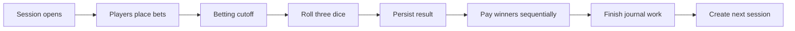

# Game rules

Each session rolls three six-sided dice and classifies their sum.

| Sum | Result | Winning side |
|---:|---|---|
| `3` | Special | Neither side |
| `4–10` | Xiu (Low) | Xiu |
| `11–17` | Tai (High) | Tai |
| `18` | Special | Neither side |

When `bet-settings.disable-special` is enabled, a roll of `3` or `18` is adjusted so the session produces a normal Tai or Xiu result.

## Session flow



The next session is not created until settlement, payouts, and required journal writes reach a safe state.

## Payout

A winning player receives their original stake plus profit after tax. With tax disabled, the payout is:

```text
payout = stake × 2
```

The `taixiu.tax.bypass` permission exempts a player from payout tax. A losing stake is not returned.

## Session IDs

A brand-new database begins at session `0`. After a safe settlement, the ID increases for the next session. Locale changes do not reset session numbering because the database—not the language pack—is the source of truth.
