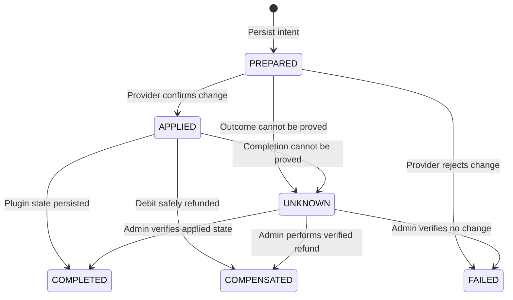

# Storage and recovery

TaiXiu stores durable state in `plugins/TaiXiu/taixiu.db`. SQLite runs with write-ahead logging, foreign keys, and schema migrations. The main tables are `sessions`, `bets`, `payouts`, and `transaction_journal`.

## Why a journal exists

The SQLite transaction and an economy provider balance change cannot be committed atomically together. TaiXiu therefore records intent before calling the provider and pauses when the outcome cannot be proven.



| State | Meaning |
|---|---|
| `PREPARED` | Intent is durable, but the external provider outcome is not confirmed. |
| `APPLIED` | The provider reported a successful balance change. |
| `COMPLETED` | Provider and plugin-side work completed safely. |
| `COMPENSATED` | A debit was refunded through a tracked operation. |
| `FAILED` | The provider definitively rejected the operation. |
| `UNKNOWN` | TaiXiu cannot prove whether money changed. |

Providers generally do not support idempotency keys, so absolute exactly-once behavior cannot be guaranteed at every crash boundary. `UNKNOWN` deliberately favors stopping over accidentally paying or charging twice.

## Health lock

An unresolved or unsafe database/provider state health-locks the game. Betting and automatic progression stay paused until an operator investigates.

```text
/taixiuadmin health
/taixiuadmin transaction list
```

Compare journal details with the provider ledger and actual balance before reconciliation. Record a useful reason in every manual action.

## Shutdown behavior

On shutdown TaiXiu stops accepting bets and settlements, tracks in-flight economy futures, waits up to `database.shutdown-transaction-timeout-seconds`, drains database work, checkpoints WAL, and closes storage. Journal-backed work that cannot reach a safe point before the timeout is persisted conservatively as `UNKNOWN`.

## Retention

- `ALL` retains all completed sessions.
- `DAYS` retains completed sessions within the configured day window.
- `COUNT` retains the newest `max-sessions` completed sessions.

Sessions with unresolved payouts are not removed by normal retention.

## Backups

For a manual backup:

1. Stop the server cleanly.
2. Wait until shutdown and the WAL checkpoint finish.
3. Copy the entire `plugins/TaiXiu/` directory.
4. Back up the economy provider data at the same logical point.

Copying only `taixiu.db` while the server is running can omit data that still resides in `taixiu.db-wal`.

## YAML migration

When 3.0 first opens an empty database, it imports only the newest unfinished legacy YAML session. It then renames the legacy directory to `session-legacy-<timestamp>`. Keep that directory until the migrated server has been fully verified.
